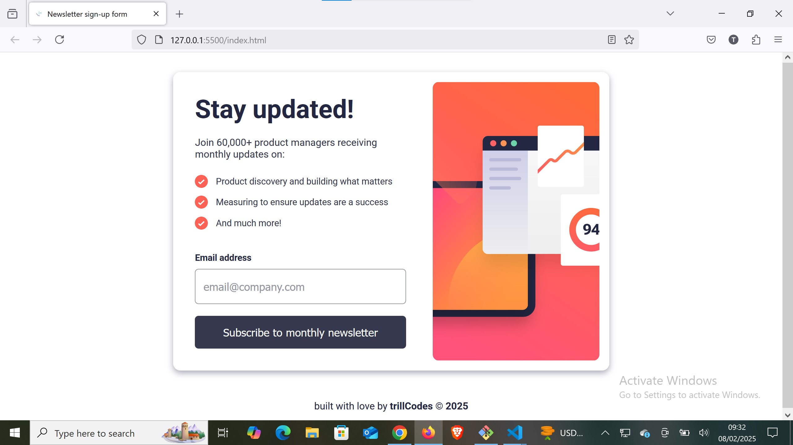

# Frontend Mentor - Newsletter sign-up form with success message


## Welcome! 👋

Thanks for checking out this front-end coding challenge.

[Frontend Mentor](https://www.frontendmentor.io) challenges help you improve your coding skills by building realistic projects.

## Table of contents

- [Overview](#overview)
  - [The challenge](#the-challenge)
  - [Screenshot](#screenshot)
  - [Links](#links)
- [My process](#my-process)
  - [Built with](#built-with)
  - [What I learned](#what-i-learned)
  - [Continued development](#continued-development)
  - [Useful resources](#useful-resources)
- [Author](#author)
- [Acknowledgments](#acknowledgments)


## Overview

### Screenshot




### Links

- Solution URL: [Github repo to the code for the challenge](https://github.com/AllisonFavour/fm-challenge9)
- Live Site URL: [Vercel link to view the challenge](https://newsletter-signup-form-xi.vercel.app)

## My process

As a regular practice now, i ensure i visualize the design preview properly which gives me a clue of how to start my project by structuring the HTML, then styling the layout structure in accordance to the design preview provided.

Finally used Javascript to handle the form interactivity and pop-up menu.


### Built with

- Semantic HTML5 markup
- CSS custom properties and Flexbox and Grid
- Javascript


### What I learned

I learnt how to practically use Javascript in manipulating the dom efficiently and also handling email validation and pop-up menu


```js
// Email regex pattern for validation
const emailPattern = /^[a-zA-Z0-9._%+-]+@[a-zA-Z0-9.-]+\.(com|net|org|edu|gov|io|co|uk)$/;

// Show validation error in real-time while typing
input.addEventListener('input', () => {
    validateEmail();
});

form.addEventListener('submit', handleForm);

function handleForm(e) {
    e.preventDefault();

    if (!validateEmail()) {
        return; // Stop form submission if email is invalid
    }

    // Hide the main page and show the pop-up
    mainElement.style.display = 'none';
    footer.style.display = 'none';
    popUpMenu.classList.add('show');

    // Clear the input field
    input.value = '';
}

// Function to validate email format
function validateEmail() {
    const email = input.value.trim();

    if (!emailPattern.test(email)) {
        errorText.innerText = 'Valid email required';
        errorText.style.display = 'block';
        input.style.border = '2px solid hsl(4, 100%, 67%)'; // Highlight error
        return false;
    }

    // If valid, remove error message
    errorText.style.display = 'none';
    input.style.border = '1px solid hsl(231, 7%, 60%)';
    document.getElementById('js-user-email').textContent = email;
    return true;
}

// Close the pop-up and restore the form
closePopUp.addEventListener('click', () => {
    popUpMenu.classList.remove('show');
    mainElement.style.display = 'block';
    footer.style.display = 'block';
});
  
```
 


### Continued development

Ensure its responsiveness to a variety of screens and also ensure the email validation works properly


## Author

- Website - [Allison Favour](https://allison-favour-portfolio-darkmode.vercel.app/)
- Frontend Mentor - [@AllisonFavour](https://www.frontendmentor.io/profile/AllisonFavour)
- Twitter - [@TrillestOjay](https://x.com/TrillestOjay)


## Acknowledgments

Thanks to my resilience for being able to start and finish this project and thanks to frontend mentor for providing such a wonderful learning platform, lastly thanks to ChatGPT for code suggestions and ideas to complete the project.